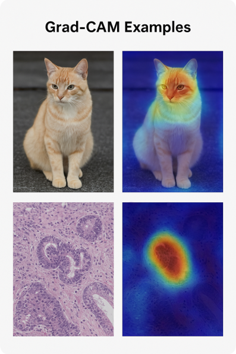
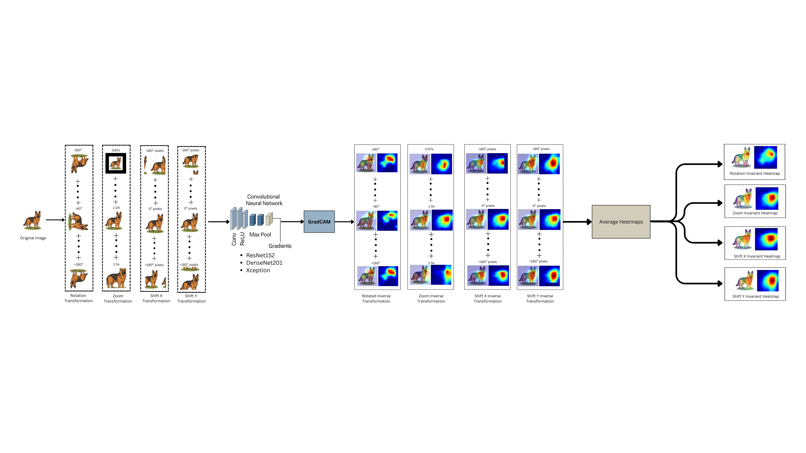

# Transformation-Invariance Properties of Grad-CAM in Convolutional Neural Networks

---

## 1. Overview

**Grad-CAM** explains a CNN's prediction by producing a heatmap over the image regions
that most influence a target class, using the gradients flowing into the final
convolutional layer. But Grad-CAM is **not transformation-invariant**: rotating,
zooming, or shifting the same image can noticeably change the heatmap even when the
prediction stays the same. This project quantifies that instability across three CNN
backbones and proposes a **realignment-and-averaging framework** that yields rotation-,
zoom-, and shift-invariant heatmaps — **without retraining the model**.

<p align="center">
  
  <br><em>Figure 1: Grad-CAM heatmaps for a natural image (top) and a histopathology patch (bottom).</em>
</p>

## 2. Research Objectives

- Quantify Grad-CAM's sensitivity to rotation, zoom, and horizontal/vertical shifts.
- Build a pipeline that inverse-realigns and averages heatmaps across transformed views.
- Propose rotation-, zoom-, and shift-invariant Grad-CAM variants.
- Validate across ResNet152, DenseNet201, and Xception.
- Evaluate both qualitatively and quantitatively (L2, AUC-ROC).

## 3. Research Questions

- **RQ1** — How sensitive is Grad-CAM to common spatial transforms?
- **RQ2** — Can that sensitivity be reliably quantified (L2, AUC-ROC)?
- **RQ3** — Can inverse realignment + averaging improve invariance?
- **RQ4** — Do architectures differ in robustness?
- **RQ5** — Does the approach generalize to natural *and* medical images?

## 4. Methodology

The proposed framework transforms the input, computes Grad-CAM on each transformed
view, inverse-aligns every heatmap back to the original coordinate frame, and averages
the aligned maps into a single, transformation-invariant explanation. It is applied
independently to four transformation families.

<p align="center">
  
  <br>
  <em>Figure 3: Overview of the proposed methodology — an image is pre-processed and
  transformed (rotation, zoom, shift-X, shift-Y), passed through a CNN backbone,
  explained with Grad-CAM, inverse-transformed back to the original frame, and
  averaged to yield rotation-, zoom-, and shift-invariant heatmaps.</em>
</p>

### 4.1 Rotation-Invariant Grad-CAM

For each angle $\theta_i \in [-180^\circ, +180^\circ]$ at $30^\circ$ increments,
rotate the original image, compute Grad-CAM, rotate the resulting map back by
$-\theta_i$, and average:

$$I^{i}_{rot} = \text{Rotate}(I_{orig}, \theta_i)$$

$$H^{i}_{rot} = \text{GradCAM}(I^{i}_{rot})$$

$$H^{i}_{realign} = \text{Rotate}(H^{i}_{rot}, -\theta_i)$$

$$H_{rot\text{-}inv} = \frac{1}{N_\theta}\sum_{i=1}^{N_\theta} H^{i}_{realign}, \quad \text{where } N_\theta = \text{total number of rotation angles}$$


### 4.2 Zoom-Invariant Grad-CAM

For each zoom factor $Z_i \in \{0.67, 0.71, 0.77, 0.83, 0.91, 1.0, 1.1, 1.2, 1.3, 1.4, 1.5\}$,
resize the image (bilinear interpolation with padding/cropping to preserve the field
of view), compute Grad-CAM, rescale the map to the original resolution, and average:

$$I^{i}_{zoom} = \text{Zoom}(I_{orig}, Z_i)$$

$$H^{i}_{zoom} = \text{GradCAM}(I^{i}_{zoom})$$

$$H^{i}_{rescale} = \text{Zoom}(H^{i}_{zoom}, \text{original size})$$

$$H_{zoom\text{-}inv} = \frac{1}{N_z}\sum_{i=1}^{N_z} H^{i}_{rescale}, \quad \text{where } N_z = \text{total number of zoom factors}$$


### 4.3 Shift-X-Invariant Grad-CAM

For each integer pixel offset $P_x \in [-180, +180]$, apply a cyclic (roll) horizontal
shift, compute Grad-CAM, shift the map back by $-P_x$, and average:

$$I^{x}_{shift} = \text{Shift}_x(I_{orig}, P_x)$$

$$H^{x}_{shift} = \text{GradCAM}(I^{x}_{shift})$$

$$H^{x}_{realign} = \text{Shift}_x(H^{x}_{shift}, -P_x)$$

$$H_{shiftX\text{-}inv} = \frac{1}{N_x}\sum_{x} H^{x}_{realign}, \quad \text{where } N_x = \text{total number of shifted pixels on the x-axis}$$


### 4.4 Shift-Y-Invariant Grad-CAM

Analogously, for each integer pixel offset $P_y \in [-180, +180]$, apply a cyclic
vertical shift, compute Grad-CAM, shift the map back by $-P_y$, and average:

$$I^{y}_{shift} = \text{Shift}_y(I_{orig}, P_y)$$

$$H^{y}_{shift} = \text{GradCAM}(I^{y}_{shift})$$

$$H^{y}_{realign} = \text{Shift}_y(H^{y}_{shift}, -P_y)$$

$$H_{shiftY\text{-}inv} = \frac{1}{N_y}\sum_{y} H^{y}_{realign}, \quad \text{where } N_y = \text{total number of shifted pixels on the y-axis}$$

### Overall Pipeline

<p align="center">
  
  <br><em>Figure 6: The complete framework — all four transformations (rotation −180° to +180°,
  zoom 0.67× to 1.5×, and horizontal/vertical shifts ±180 px) applied to a single image,
  each Grad-CAM map inverse-aligned and averaged into invariant heatmaps.</em>
</p>

## 5. Experimental Setup

### Model Architectures

All backbones are ImageNet-pretrained and used without fine-tuning; Grad-CAM is
computed at the last convolutional layer before global pooling.

| Model | Parameters (M) | Grad-CAM Layer | Input Size |
|---|---|---|---|
| ResNet152 | 60.2 | `conv5_block3_out` | 224 × 224 |
| DenseNet201 | 20.2 | `conv5_block32_concat` | 224 × 224 |
| Xception | 22.9 | `block14_sepconv2_act` | 299 × 299 |

*Table 1: Model architectures and Grad-CAM configuration.*

### Datasets

| Dataset | Classes | Training | Validation | Test |
|---|---|---|---|---|
| MS COCO (2017) | 80 | 118,287 | 5,000 | 20,000 |
| CAMELYON16 (patches) | 2 | 64,000 | 8,000 | 8,000 |

*Table 2: Dataset statistics.*

### Evaluation Metrics

- **L2 difference** — pixel-wise Euclidean distance between two heatmaps; **lower = more stable**.

$$L2 = \sqrt{\sum_{i}\left(H^{orig}_i - H^{trans}_i\right)^2}$$

- **AUC-ROC** — how well the normalized heatmap separates the object/tumor region from
  background against a binary mask; **higher = better localization** (reported as
  $\mu \pm \sigma$ across images).

## 6. Experiments

### Experiment 1 — Single-Image Transformation Consistency

Apply each of the four transformations to a single image (per backbone), inverse-align
every heatmap, and average. Sensitivity is measured by the L2 difference across
transformation magnitudes.

### Experiment 2 — Class-Specific Evaluation

Repeat the analysis for two object categories ("Dog", "Cat") across all three
backbones to test whether robustness is class-dependent.

### Experiment 3 — Dataset-Level Evaluation (MS COCO)

Scale up to MS COCO (80 classes with pixel-level masks). Binary ground-truth masks are
built from COCO polygon/RLE annotations, and each backbone's Baseline is compared
against the four invariant variants by L2 and AUC-ROC.

| Model | Baseline AUC | Rotation-inv (L2 / AUC) | Zoom-inv (L2 / AUC) | Shift-X-inv (L2 / AUC) | Shift-Y-inv (L2 / AUC) |
|---|---|---|---|---|---|
| ResNet152 | 0.832 ± 0.021 | 0.25 / 0.851 ± 0.017 | 0.22 / 0.871 ± 0.015 | 0.18 / 0.881 ± 0.016 | 0.20 / 0.870 ± 0.017 |
| DenseNet201 | 0.846 ± 0.019 | 0.21 / 0.874 ± 0.018 | 0.19 / 0.892 ± 0.013 | 0.15 / 0.901 ± 0.014 | 0.17 / 0.895 ± 0.011 |
| Xception | 0.827 ± 0.023 | 0.29 / 0.843 ± 0.019 | 0.26 / 0.862 ± 0.018 | 0.22 / 0.849 ± 0.020 | 0.23 / 0.844 ± 0.021 |

*Table 3: MS COCO — Baseline vs. transformation-invariant Grad-CAM (L2 / AUC (µ ± σ);
lower L2 and higher AUC are better; Baseline L2 = 0 by definition). Every invariant
variant raises AUC over Baseline, with shift-X and zoom giving the most consistent gains.*

### Experiment 4 — Histopathology Image Evaluation (CAMELYON16)

Evaluate **zoom-invariant** Grad-CAM on histopathology patches (96 × 96 px; a patch is
labeled tumor if its central 32 × 32 region contains tumor tissue). For each patch,
Grad-CAM maps across zoom levels are inverse-aligned and averaged; stability (L2) and
faithfulness (AUC-ROC vs. tumor masks) are reported per backbone.

| Model | Setting | L2 Difference | AUC (µ ± σ) |
|---|---|---|---|
| ResNet152 | Baseline (1.0×) | 0 | 0.85 ± 0.018 |
| ResNet152 | Averaged | 0.21 | 0.89 ± 0.012 |
| DenseNet201 | Baseline (1.0×) | 0 | 0.87 ± 0.016 |
| DenseNet201 | Averaged | 0.18 | 0.91 ± 0.010 |
| Xception | Baseline (1.0×) | 0 | 0.83 ± 0.020 |
| Xception | Averaged | 0.24 | 0.88 ± 0.015 |

*Table 4: CAMELYON16 — zoom-invariance evaluation. Averaging raises AUC for all three
backbones at a small L2 cost.*

## 7. Results & Key Findings

- Grad-CAM is **measurably sensitive** to rotation, zoom, and shifts.
- **Inverse-alignment + averaging materially improves stability** — lower L2 and higher AUC than Baseline.
- Gains hold **across all three backbones and both domains** (natural and medical images).
- Achieved with **no model retraining**.

## 8. Conclusion

This work quantified Grad-CAM's transformation sensitivity, proposed an invariant
heatmap pipeline based on inverse alignment and averaging, and demonstrated improved
stability (lower L2, better AUC) across architectures and datasets — a practical step
toward trustworthy, consistent visual explanations.

## 9. Future Directions

- Extend the invariance pipeline to other XAI methods.
- Explore joint training with invariance regularization.
- Generalize to detection, segmentation, and multimodal tasks.
- Create standardized robustness benchmarks and user studies.

## 10. Repository Structure

```
transformation-invariant-gradcam/
├── README.md        # this file
├── assets/          # figures used in this README
├── docs/            # thesis paper + defense presentation
├── src/             # Grad-CAM, invariant framework, transforms, metrics, models
├── experiments/     # exp1 single-image · exp2 class-specific · exp3 MS COCO · exp4 histopathology
├── scripts/         # run_experiment.py (CLI)
├── data/            # datasets not committed — see data/README.md
└── results/         # generated figures and tables
```

```bash
pip install -r requirements.txt
python scripts/run_experiment.py exp1 --model resnet152 --image path/to/img.jpg --transform rotation
```

---

## About This Project

This work originated as my MSc thesis at **Ontario Tech University**, developed under
the supervision of **Professor Mehran Ebrahimi**.

Part of this project has been accepted as a Poster presentation at the Conference on
Vision and Intelligent Systems (CVIS 2024), University of Waterloo.
Link: [https://github.com/emonroy7/CVIS2024/blob/main/poster.pdf](https://github.com/emonroy7/CVIS2024/blob/main/poster.pdf)

My thesis/dissertation/project has been published to the Library's institutional
repository eScholar.
URI: [https://hdl.handle.net/10155/2057](https://hdl.handle.net/10155/2057)
